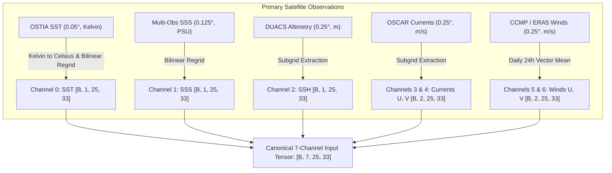

# DATASET SOURCE MATRIX: 7-Channel Surface Input Data Audit (SIH26066)

**Document Version:** 1.0  
**Audit Date:** 2026-09-04  
**Project:** OceanEmbed MVP  
**Target Domain:** $12.0^\circ - 18.0^\circ\text{N}$, $85.0^\circ - 93.0^\circ\text{E}$ (Central Bay of Bengal Pilot Box)  
**Target Period:** `2020-01-01` through `2020-01-30` (30 consecutive daily timestamps)  
**Target Grid:** $0.25^\circ \times 0.25^\circ$ regular grid ($25 \times 33 = 825$ grid points, daily frequency)  
**Authority:** Official INCOIS SIH26066 Problem Statement Specification  

---

## 1. Executive Summary & Gate A1.4 Verdict

An exhaustive audit of the surface-input acquisition and synchronization stage was conducted against local disk assets (`Dataset/`) and authoritative scientific source registries.

### Primary Scientific Findings:
1. **Pure Satellite Mode (`SATELLITE_OBSERVATION`):** **`BLOCKED (0 / 7 Channels Available)`**
   - No synchronized satellite observations exist for the required 30-day pilot period (`2020-01-01` to `2020-01-30`).
   - Local satellite files in `Dataset/` suffer from **extreme temporal discordance** (single isolated global snapshots from March 2026, January 2026, and December 2024).
   - OSCAR surface currents are absent from disk.
   - ASCAT-L2 wind swaths on disk cover only $\sim 1\text{ day}$ (January 1, 2020), leaving 29 days missing.
2. **Reanalysis Fallback Mode (`REANALYSIS_FALLBACK`):** **`PARTIALLY AVAILABLE (5 / 7 Channels Available, 2 Blocked)`**
   - Channels 0–4 (SST, SSS, SSH, U-current, V-current) are **AVAILABLE AS FALLBACK** from the preprocessed 30-day GLORYS12V1 dataset (`Dataset/gate_a1_pilot/glorys_pilot_30d_15depths_preprocessed.nc`).
   - Channels 5–6 (U-wind, V-wind) are **STRICTLY BLOCKED** under GLORYS because GLORYS12V1 is a pure hydrodynamic ocean reanalysis that does NOT output atmospheric $10\text{m}$ wind vectors. Atmospheric wind reanalysis (e.g. ECMWF ERA5) or satellite winds (CCMP v3.1) must be independently acquired.
3. **No Silent Substitution & No Data Fabrication:** GLORYS variables are strictly labeled as **`FALLBACK (REANALYSIS)`** and are NEVER labeled as satellite observations. Zero synthetic or fabricated data has been mixed into the real NetCDF pipeline.

---

## 2. Comprehensive 7-Channel Dataset Source Matrix

| Channel Index & Name | Primary Product & Dataset ID | Native Spatial Res | Native Temporal Res | Native Units | Target Units | Regridding Required? | Daily Aggregation? | Coordinate Transforms | Missing Data & Land Masking | Access & Licensing Constraints | Status (Local Disk: 2020 Pilot Window) |
| :---: | :--- | :---: | :---: | :---: | :---: | :---: | :---: | :--- | :--- | :--- | :---: |
| **Ch 0: SST**<br>(Sea Surface Temp) | **OSTIA L4 Reprocessed**<br>`SST_GLO_SST_L4_REP_OBSERVATIONS_010_011`<br>Dataset: `cmems_SST_GLO_SST_L4_REP_OBSERVATIONS_010_011` | $0.05^\circ \times 0.05^\circ$<br>($\approx 6\text{ km}$) | Daily foundation SST (midnight UTC) | Kelvin ($\text{K}$) | $^\circ\text{C}$ | **Yes**<br>Bilinear interpolation from $0.05^\circ \to 0.25^\circ$ | **No**<br>(Already daily foundation SST) | $T_{^\circ\text{C}} = T_{\text{K}} - 273.15$<br>Longitudes: $-180..180^\circ$ | Land mask flags; missing values set to NaN. Cloud-penetrating MW+IR blend. | Open CMEMS license; free Copernicus account required. | **BLOCKED (Primary)**<br>Local file is `2026-03-31` (0/30 days).<br>**FALLBACK (GLORYS)**: `thetao` ($z=0$) is **AVAILABLE**. |
| **Ch 1: SSS**<br>(Sea Surface Salinity) | **Multi-Obs SMAP+SMOS L4 SSS**<br>`MULTIOBS_GLO_PHY_S_SURFACE_MYNRT_015_013`<br>Dataset: `cmems_obs-mob_glo_phy-sss_my_multi_P1D` | $0.125^\circ \times 0.125^\circ$<br>($\approx 12.5\text{ km}$) | Daily | $10^{-3}$ ($\text{PSU}$) | $\text{PSU}$ | **Yes**<br>Bilinear interpolation from $0.125^\circ \to 0.25^\circ$ | **No**<br>(Already daily L4 optimal interpolation) | None<br>(Direct identity mapping) | Severe coastal RFI / land contamination within $50\text{ km}$; pilot box ($12-18^\circ\text{N}$) avoids coast. | Open CMEMS license; free Copernicus account required. | **BLOCKED (Primary)**<br>Local file is `2024-12-15` (0/30 days).<br>**FALLBACK (GLORYS)**: `so` ($z=0$) is **AVAILABLE**. |
| **Ch 2: SSH / SLA**<br>(Sea Surface Height) | **DUACS Multi-Mission Altimetry L4**<br>`SEALEVEL_GLO_PHY_L4_MY_008_047`<br>Dataset: `c3s_obs-sl_glo_phy-ssh_my_twosat-l4-duacs-0.25deg_P1D` | $0.25^\circ \times 0.25^\circ$ | Daily | meters ($\text{m}$) | $\text{m}$ | **No**<br>(Natively aligned to $0.25^\circ$) | **No**<br>(Already daily multi-satellite optimal interpolation) | Longitude alignment: $-180..180^\circ \to 85..93^\circ\text{E}$ is identity. | Inter-track interpolation error (`err_sla`); land pixels masked as NaN. | Open Copernicus / C3S license; free account required. | **BLOCKED (Primary)**<br>Local file is `2026-01-16` (0/30 days).<br>**FALLBACK (GLORYS)**: `zos` is **AVAILABLE**. |
| **Ch 3: Current U**<br>(Zonal Current) | **OSCAR Surface Currents v2.0**<br>`OSCAR_L4_OC_FINAL_V2.0`<br>Provider: ESR / NASA PO.DAAC | $0.25^\circ \times 0.25^\circ$ | Daily | $\text{m/s}$ | $\text{m/s}$ (eastward) | **No**<br>(Natively aligned to $0.25^\circ$) | **No**<br>(Already daily average) | Longitudes: $0..360^\circ$ convention; $85..93^\circ\text{E}$ directly matches without wrapping. | Missing near coastlines; top 30m mixed layer flow. | Open NASA Earthdata license; free account required. | **BLOCKED (Primary)**<br>Missing completely on disk.<br>**FALLBACK (GLORYS)**: `uo` ($z=0$) is **AVAILABLE**. |
| **Ch 4: Current V**<br>(Meridional Current) | **OSCAR Surface Currents v2.0**<br>`OSCAR_L4_OC_FINAL_V2.0`<br>Provider: ESR / NASA PO.DAAC | $0.25^\circ \times 0.25^\circ$ | Daily | $\text{m/s}$ | $\text{m/s}$ (northward) | **No**<br>(Natively aligned to $0.25^\circ$) | **No**<br>(Already daily average) | Longitudes: $0..360^\circ$ convention. | Missing near coastlines; top 30m mixed layer flow. | Open NASA Earthdata license; free account required. | **BLOCKED (Primary)**<br>Missing completely on disk.<br>**FALLBACK (GLORYS)**: `vo` ($z=0$) is **AVAILABLE**. |
| **Ch 5: Wind U**<br>(10m Zonal Wind) | **CCMP v3.1 Gridded Vector Winds**<br>`CCMP_V3.1_L4`<br>Provider: RSS / NASA PO.DAAC / OSI SAF | $0.25^\circ \times 0.25^\circ$<br>*(ASCAT is ungridded L2)* | 6-hourly (CCMP)<br>Orbital passes (ASCAT) | $\text{m/s}$ | $\text{m/s}$ (10m eastward vector) | **Yes for ASCAT L2**<br>(Swath binning $\to 0.25^\circ$); **No for CCMP** | **Yes**<br>Calculate 24h vector mean from 6-hourly analyses. | None for CCMP; ASCAT swath coordinate projection required. | Rain-flagging contamination; gap-filling required if using raw orbital swath. | Open NASA Earthdata / EUMETSAT license. | **BLOCKED (Primary)**<br>ASCAT granules only cover 2020-01-01 (1/30 days); CCMP missing.<br>**FALLBACK (GLORYS)**: **BLOCKED** (GLORYS has no winds). |
| **Ch 6: Wind V**<br>(10m Meridional Wind) | **CCMP v3.1 Gridded Vector Winds**<br>`CCMP_V3.1_L4`<br>Provider: RSS / NASA PO.DAAC / OSI SAF | $0.25^\circ \times 0.25^\circ$<br>*(ASCAT is ungridded L2)* | 6-hourly (CCMP)<br>Orbital passes (ASCAT) | $\text{m/s}$ | $\text{m/s}$ (10m northward vector) | **Yes for ASCAT L2**<br>(Swath binning $\to 0.25^\circ$); **No for CCMP** | **Yes**<br>Calculate 24h vector mean from 6-hourly analyses. | None for CCMP; ASCAT swath coordinate projection required. | Rain-flagging contamination; gap-filling required if using raw orbital swath. | Open NASA Earthdata / EUMETSAT license. | **BLOCKED (Primary)**<br>ASCAT granules only cover 2020-01-01 (1/30 days); CCMP missing.<br>**FALLBACK (GLORYS)**: **BLOCKED** (GLORYS has no winds). |

---

## 3. Analysis of Discovered Local NetCDF Inventory

The local scanning tool discovered **23 NetCDF files** on disk. The table below details their parameters, verified timestamps, and why they fail synchronization with the 30-day pilot window (`2020-01-01` to `2020-01-30`):

| Local File Path | Size | Native Grid & Coverage | Timestamp in File | Audit Finding |
| :--- | :---: | :---: | :---: | :--- |
| `Dataset/METOFFICE-GLO-SST-L4-REP-OBS-SST_1788514360579.nc` | 414.78 MB | $3600 \times 7200$ ($0.05^\circ$ global) | `2026-03-31T00:00:00` | **TEMPORAL MISMATCH:** Snapshot from March 2026. Zero overlap with January 2020. |
| `Dataset/cmems_obs-mob_glo_phy-sss_my_multi_P1D_1788514338421.nc` | 82.98 MB | $1440 \times 2880$ ($0.125^\circ$ global) | `2024-12-15T00:00:00` | **TEMPORAL MISMATCH:** Snapshot from December 2024. Zero overlap with January 2020. |
| `Dataset/c3s_obs-sl_glo_phy-ssh_my_twosat-l4-duacs-0.25deg_P1D_1788514168280.nc` | 41.52 MB | $720 \times 1440$ ($0.25^\circ$ global) | `2026-01-16T00:00:00` | **TEMPORAL MISMATCH:** Snapshot from January 2026. Zero overlap with January 2020. |
| `Dataset/ASCAT/ascat_20200101_*_metopc_ovw.l2.nc` (16 files) | 54.76 MB | $3264 \times 82$ (Orbital swath cells) | `2019-12-31 22:33` to `2020-01-01 23:54` | **INSUFFICIENT DURATION:** Covers only ~25 hours (Jan 1, 2020). 29 out of 30 days missing. Ungridded L2. |
| `Dataset/gate_a1_pilot/glorys_pilot_30d_15depths_preprocessed.nc` | 64.83 MB | $73 \times 97$ ($0.0833^\circ$, $12-18^\circ\text{N}, 85-93^\circ\text{E}$) | `2020-01-01` to `2020-01-30` (30 days) | **AVAILABLE AS REANALYSIS FALLBACK:** Contains 30 daily steps of `thetao`, `so`, `zos`, `uo`, `vo`. (NO WINDS). |

---

## 4. Required Data Transformations & Regridding Specification

To ingest surface fields into the canonical OceanEmbed input tensor $[B, 7, H, W]$ ($H=25, W=33$ at $0.25^\circ$ spacing over $12-18^\circ\text{N}, 85-93^\circ\text{E}$), the following pipeline transformations must be executed:



### Specific Mathematical & Geometric Transformations:
1. **SST Transformation:**
   - Conversion: $T_{\text{target}}(y, x) = T_{\text{OSTIA}}(y, x) - 273.15$
   - Horizontal Operator: Bilinear spatial interpolation from regular $0.05^\circ$ grid ($120 \times 160$ cells) to $0.25^\circ$ grid ($25 \times 33$ points).
2. **SSS Transformation:**
   - Conversion: Identity (PSU units match).
   - Horizontal Operator: Bilinear spatial interpolation from $0.125^\circ$ ($48 \times 64$ cells) to $0.25^\circ$ grid.
3. **SSH / SLA Transformation:**
   - Conversion: Identity (meters).
   - Horizontal Operator: Direct sub-grid index slicing (DUACS natively resides on standard $0.25^\circ$ grid).
4. **Currents U, V Transformation:**
   - Conversion: Identity ($\text{m/s}$).
   - Coordinate check: OSCAR longitudes run $0^\circ$ to $360^\circ$. For Bay of Bengal ($85.0^\circ\text{E} \to 93.0^\circ\text{E}$), values are in identical positive degrees. No prime meridian wrapping is required.
5. **Winds U, V Transformation:**
   - Daily vector aggregation: When 6-hourly CCMP or ERA5 is used:
     $$\bar{u}_{\text{daily}} = \frac{1}{4} \sum_{i=1}^4 u_{6\text{h}, i}, \quad \bar{v}_{\text{daily}} = \frac{1}{4} \sum_{i=1}^4 v_{6\text{h}, i}$$
   - Wind speed must NEVER be averaged before vector components ($|\bar{\mathbf{u}}| \ne \overline{|\mathbf{u}|}$).

---

## 5. Unresolved Scientific & Engineering Risks

1. **Risk 1: Wind Channel Absence in GLORYS Reanalysis Fallback**
   - *Issue:* GLORYS12V1 does not contain atmospheric winds.
   - *Impact:* Training a 7-channel model exclusively from the GLORYS pilot download is **impossible** without external winds.
   - *Mitigation:* Either:
     - (Option A) Download the 30-day pilot slice of ECMWF ERA5 10m winds (`u10`, `v10`) via Copernicus CDS / ECMWF API.
     - (Option B) Download CCMP v3.1 satellite winds from NASA PO.DAAC.
     - (Option C) Explicitly configure a reduced 5-channel hydrodynamic baseline (`[sst, sss, ssh, u_curr, v_curr]`) until winds are acquired.
2. **Risk 2: Multi-Agency Authentication Overhead for Primary Satellite Stream**
   - *Issue:* The primary satellite suite requires active credentials across multiple agencies:
     - Copernicus Marine (OSTIA, SSS, DUACS)
     - NASA Earthdata (OSCAR, RSS CCMP / SMAP)
   - *Impact:* Automated download pipelines will fail without `.netrc` / `.copernicusmarine-credentials` properly configured.
3. **Risk 3: Swath-to-Grid Irregularity in ASCAT L2**
   - *Issue:* Raw ASCAT L2 Coastal data consists of orbital swathes on irregular Wind Vector Cells (WVC) rather than a gridded daily field.
   - *Impact:* Gridding ASCAT L2 requires spatial binning, swath compositing, and handling swath gaps between MetOp-A/B/C passes.
   - *Mitigation:* RSS CCMP v3.1 or CMEMS L4 gridded wind product is strongly recommended over raw L2 swathes.

---

## 6. Actionable Download Commands for Primary Satellite Suite

To resolve the BLOCKED status of the primary satellite suite for the 30-day pilot window, execute the following bounded commands:

### 1. OSTIA SST (Copernicus Marine API)
```powershell
copernicusmarine subset `
  --dataset-id cmems_SST_GLO_SST_L4_REP_OBSERVATIONS_010_011 `
  --variable analysed_sst `
  --start-datetime 2020-01-01T00:00:00 `
  --end-datetime 2020-01-30T23:59:59 `
  --minimum-longitude 85.0 --maximum-longitude 93.0 `
  --minimum-latitude 12.0 --maximum-latitude 18.0 `
  --output-directory Dataset/gate_a1_pilot/satellite `
  --output-filename ostia_sst_pilot_30d.nc
```

### 2. Multi-Obs SSS (Copernicus Marine API)
```powershell
copernicusmarine subset `
  --dataset-id cmems_obs-mob_glo_phy-sss_my_multi_P1D `
  --variable sos `
  --start-datetime 2020-01-01T00:00:00 `
  --end-datetime 2020-01-30T23:59:59 `
  --minimum-longitude 85.0 --maximum-longitude 93.0 `
  --minimum-latitude 12.0 --maximum-latitude 18.0 `
  --output-directory Dataset/gate_a1_pilot/satellite `
  --output-filename multi_obs_sss_pilot_30d.nc
```

### 3. DUACS SSH / SLA (Copernicus Marine API)
```powershell
copernicusmarine subset `
  --dataset-id c3s_obs-sl_glo_phy-ssh_my_twosat-l4-duacs-0.25deg_P1D `
  --variable adt --variable sla `
  --start-datetime 2020-01-01T00:00:00 `
  --end-datetime 2020-01-30T23:59:59 `
  --minimum-longitude 85.0 --maximum-longitude 93.0 `
  --minimum-latitude 12.0 --maximum-latitude 18.0 `
  --output-directory Dataset/gate_a1_pilot/satellite `
  --output-filename duacs_ssh_pilot_30d.nc
```

---

## 7. Final Gate A1.4 Summary

- **Total Canonical Channels Audited:** 7
- **Primary Satellite Mode (`SATELLITE_OBSERVATION`):** **`BLOCKED (0/7 synchronized)`**
- **Reanalysis Fallback Mode (`REANALYSIS_FALLBACK`):** **`5/7 AVAILABLE (SST, SSS, SSH, Current-U, Current-V) | 2/7 BLOCKED (Wind-U, Wind-V)`**
- **Status of Preprocessed Targets (15 Depths):** **`VERIFIED & READY`** in `Dataset/gate_a1_pilot/glorys_pilot_30d_15depths_preprocessed.nc`

*Execution stopped for Gate A1.4 review.*
