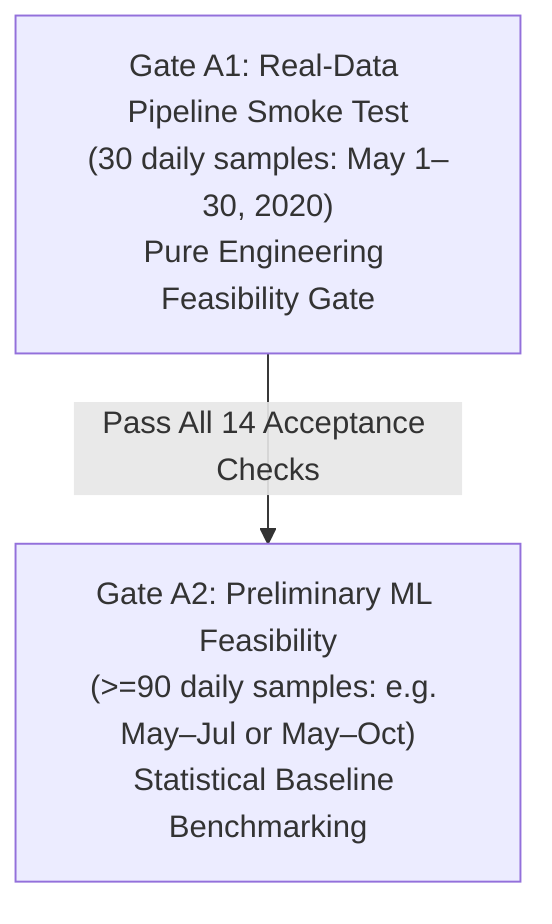

# OceanEmbed: Experiment Contract & Scientific Manifest (SIH26066 Aligned)

This document defines the formal, immutable experiment contract for the **OceanEmbed** project under official Problem Statement **SIH26066**. It ensures complete scientific reproducibility, eliminates data leakage, and establishes unambiguous evaluation criteria before any real-data ingestion or model training.

---

## 1. Phased Experimental Gating: Gate A1 vs. Gate A2

To preserve scientific rigor, the real-data evaluation is decoupled into two explicit stages:



### Gate A1: Real-Data Pipeline Smoke Test (30 Daily Samples)
- **Primary Objective:** End-to-end engineering verification without large bandwidth or compute requirements.
- **Scope of Verification:**
  - NetCDF file download and parsing via `xarray`.
  - Empirical coordinate verification (ascending latitude/longitude, CF-compliant daily timestamps).
  - Spatial regridding to standard $0.25^\circ$ geographic grid.
  - Land/ocean mask calculation (`ocean_coverage = valid_ocean_cells / total_grid_cells`).
  - Channel-wise Z-score normalization computed strictly on the training partition.
  - 7-channel input tensor stacking: `[B, 7, H, W]`.
  - 15-depth vertical target profile extraction: `[B, 15]`.
  - GPU forward/backward pass verification on laptop hardware (RTX 4050 6 GB).
- **Critical Scientific Boundary:** Gate A1 results are **not** presented as sufficient evidence of model generalization, operational readiness, or statistically meaningful superiority over traditional methods.

### Gate A2: Preliminary ML Feasibility Experiment (>=90 Daily Samples)
- **Primary Objective:** Preliminary machine learning performance evaluation across seasonal or multi-month dynamics.
- **Recommended Scale:** Minimum 90 daily samples (e.g. May 1 to July 31, 2020, capturing the onset and peak of the Southwest Monsoon).
- **Scope of Evaluation:**
  - Strict temporal holdout evaluation (train on earlier contiguous 70% of days, test on held-out latest 15%).
  - Statistical comparison against standard baselines: Climatology, SST-only Linear Persistence, and Multi-input Linear Regression.
  - Systematic depth-wise reporting: RMSE, Bias, and Pearson correlation across all 15 depths and specifically within the 50–200m thermocline.

---

## 2. Gate A1 Formal Experiment Manifest

```yaml
experiment_id: "EXP-GATE-A1-SMOKE-001"
model_version: "SatEmbedNet-v0.1-profile"
random_seed: 42

# --- Scientific Data Source Mode ---
# Permitted modes: SATELLITE_OBSERVATION | REANALYSIS_FALLBACK | MIXED
# MANDATORY DECLARATION: For Phase-A engineering convenience, surface variables are 
# extracted from GLORYS12V1 to prove ingestion mechanics without multi-portal overhead.
# This mode is strictly designated as REANALYSIS_FALLBACK. GLORYS-derived surface variables
# are NOT equivalent to the final satellite-observation input configuration.
# The final PS-aligned experiment must use actual observation-derived surface products.
data_source_mode: "REANALYSIS_FALLBACK"

# --- Domain & Grid ---
domain:
  official_ps_domain: "North Indian Ocean (5.0°N–30.0°N, 45.0°E–105.0°E)"
  active_experiment_subset: "Central Bay of Bengal Pilot Box (12.0°N–18.0°N, 85.0°E–93.0°E)"
  is_pilot_subset: true
  selection_rationale: "Selected to minimize expected coastal/land-mask contamination."
resolution: "0.25° × 0.25° regular geographic grid"
temporal_resolution: "Daily (UTC daily-mean aggregation)"

# --- Temporal Range & Leakage Protection ---
time_range:
  start_date: "2020-05-01"
  end_date: "2020-05-30"
  total_days: 30
split_strategy: "temporal_holdout"   # Contiguous chronological blocks; NO random shuffling
train_split:
  dates: "2020-05-01 to 2020-05-21"  # Days 1–21 (70%)
validation_split:
  dates: "2020-05-22 to 2020-05-25"  # Days 22–25 (15% tuning / early stopping)
test_split:
  dates: "2020-05-26 to 2020-05-30"  # Days 26–30 (15% strictly held-out future evaluation)

# --- 7 Input Channels (Canonical Order & Primary SIH26066 Sources) ---
input_channels:
  count: 7
  tensor_shape: "[B, 7, H, W]"
  channels:
    0: { name: "sst", parameter: "Sea Surface Temperature", unit: "degC", primary_source: "OSTIA (0.05°, Daily) [PRIMARY]", fallback_sources: "NOAA OISST v2.1 / GLORYS12V1 thetao (z=0.494m)" }
    1: { name: "sss", parameter: "Sea Surface Salinity", unit: "PSU", primary_source: "SMAP / SMOS (0.125°, Daily) [PRIMARY]", fallback_sources: "CMEMS Multi-Year SSS L4 / GLORYS12V1 so (z=0.494m)" }
    2: { name: "ssh", parameter: "Sea Level Anomaly / SSH", unit: "m", primary_source: "DUACS (0.25°, Daily) [PRIMARY]", fallback_sources: "GLORYS12V1 zos" }
    3: { name: "u_current", parameter: "Surface Current Zonal Velocity", unit: "m/s", primary_source: "OSCAR (0.25°, Daily) [PRIMARY]", fallback_sources: "GLORYS12V1 uo (z=0.494m)" }
    4: { name: "v_current", parameter: "Surface Current Meridional Velocity", unit: "m/s", primary_source: "OSCAR (0.25°, Daily) [PRIMARY]", fallback_sources: "GLORYS12V1 vo (z=0.494m)" }
    5: { name: "u_wind", parameter: "10m Surface Wind Zonal Velocity", unit: "m/s", primary_source: "ASCAT-L2 Coastal / CCMP (0.25°, Daily) [PRIMARY]", fallback_sources: "ECMWF ERA5 u10" }
    6: { name: "v_wind", parameter: "10m Surface Wind Meridional Velocity", unit: "m/s", primary_source: "ASCAT-L2 Coastal / CCMP (0.25°, Daily) [PRIMARY]", fallback_sources: "ECMWF ERA5 v10" }

observational_benchmark:
  primary_source: "INCOIS LAS — Gridded ARGO (Indian Ocean Product) [PRIMARY]"
  fallback_source: "Coriolis GDAC In-situ ARGO Float Profiles [FALLBACK]"

# --- 15 Vertical Target Depths & 0-Meter Handling ---
target_product:
  name: "Copernicus GLORYS12V1 (GLOBAL_MULTIYEAR_PHY_001_030)"
  parameter: "thetao (Potential Temperature)"
  unit: "degC"
  depth_levels: [0, 5, 10, 20, 30, 50, 75, 100, 125, 150, 200, 300, 500, 700, 1000] # meters
  depth_count: 15
  output_tensor_shape: "[B, 15]"   # Profile regression mode for Gate A1
  vertical_mapping_rules:
    depth_0m: "Mapped to nearest valid surface GLORYS level (~0.494m). Blind extrapolation to 0m is forbidden."
    depth_gt_0m: "Vertically interpolated from native 50 GLORYS geopotential levels without unconstrained extrapolation."

# --- Preprocessing & Masking ---
normalization_method: "zscore"     # Channel-wise (x - mean) / std computed STRICTLY on train_split
missing_value_policy:
  land_mask: "Static binary land-sea mask based on GLORYS bathymetry"
  ocean_coverage_reporting: "Calculate ocean_coverage = valid_ocean_cells / total_grid_cells upon file inspection"
  ocean_nans: "Reject sample or spatial nearest-neighbor interpolation if missing cell count < 0.5%"
  leakage_guard: "No forward-fill or moving-average filtering across the train/test temporal boundary"

# --- Baseline Benchmarks & Evaluation (Gate A2 Scope) ---
baseline_models:
  - "Climatology (monthly mean vertical temperature profile)"
  - "SST-only Linear Regression (T(z) = a_z * SST + b_z)"
  - "Multi-input Linear Regression (T(z) = W_z * [SST, SSS, SSH, u_c, v_c, u_w, v_w] + b_z)"
  - "SatEmbedNet (CNN Latent Encoder + MLP Regressor)"

metrics:
  primary: ["RMSE (degC)", "Pearson Correlation (r)", "Bias (degC)"]
  stratifications:
    - "Overall full column (0–1000m)"
    - "Mixed-layer (0–30m)"
    - "Thermocline zone (50–200m)"
    - "Deep layer (300–1000m)"
  optional_stretch_target: "20% RMSE reduction over persistence in the 50–200m thermocline (optional stretch only, not a pass/fail requirement)"
```

---

## 3. Architecture Specification: Profile Regression vs. Dense 3D Field

- **Current Implementation (Profile Regression Mode):**
  - Shape: `[B, 7, H, W] -> CNN Encoder -> AdaptiveAvgPool -> Linear(128) -> MLP Regressor -> [B, 15]`
  - Scope: Regresses domain-average vertical profiles across the 15 standard depths for Gate A1 pipeline testing.
  - Explicit Limit: Does **not** claim to be a dense 3D spatial field.
- **Future Problem Statement Target (Dense 3D Field Mode):**
  - Shape: `[B, 7, H, W] -> Spatial Encoder-Decoder (e.g. U-Net / FPN) -> [B, 15, H, W]`
  - Scope: Outputs a 3D volumetric field where each spatial coordinate $(i, j)$ contains an independent 15-depth vertical temperature column $T(z, y, x)$.

---

## 4. Physics-Informed Loss Constraints: Classification & Caution

- In the Northern Bay of Bengal, freshwater runoff creates strong salinity barrier layers that sustain natural **thermal inversions** (where temperature increases with depth over the upper 20–60 m).
- Enforcing strict vertical temperature monotonicity ($\frac{\partial T}{\partial z} \le 0$) as a mandatory loss is **scientifically invalid**.
- Vertical monotonicity penalties are classified strictly as an **optional experimental component**, and are excluded from Gate A1.

---

## 5. Gate A1 Automated Acceptance Test Harness

Before proceeding to any model evaluation, the ingested real-data pipeline must satisfy all 14 automated acceptance tests defined in [`tests/test_a1_acceptance.py`](file:///c:/Users/Jarsh/Downloads/oceanembed_mvp/oceanembed/tests/test_a1_acceptance.py):

- [X] **Test 01:** Exactly 7 input channels (`INPUT_CHANNELS == 7`)
- [X] **Test 02:** Exact canonical channel ordering (`sst`, `sss`, `ssh`, `u_current`, `v_current`, `u_wind`, `v_wind`)
- [X] **Test 03:** Exact 15 canonical target depths (`REQUIRED_DEPTHS_M`, no 400m or 750m)
- [X] **Test 04:** Target depth 0 m maps to nearest valid surface level (~0.494 m) without blind extrapolation
- [X] **Test 05:** Target depth interpolation produces no out-of-bounds vertical extrapolation
- [X] **Test 06:** Timestamps strictly daily ($1\text{-day}$ step)
- [X] **Test 07:** Latitude coordinates strictly ascending
- [X] **Test 08:** Longitude coordinates strictly ascending
- [X] **Test 09:** Expected $0.25^\circ \times 0.25^\circ$ regular output grid
- [X] **Test 10:** Physical units verified ($^\circ\text{C}$, $\text{PSU}$, $\text{m}$, $\text{m/s}$)
- [X] **Test 11:** Missing-value policy verified (handling of land vs. ocean cells)
- [X] **Test 12:** Land/ocean coverage empirically measured and reported
- [X] **Test 13:** Model input tensor shape strictly `[B, 7, H, W]`
- [X] **Test 14:** Model target shape strictly `[B, 15]`

---

## 6. Phase-A Acquisition Specification (Product Metadata Verified; File-Level Metadata Pending)

> [!NOTE]
> The specifications below represent verified **product-level** metadata from Copernicus Marine Service and ECMWF. Actual **file-level** metadata will be empirically audited via `src/inspect_metadata.py` immediately upon receipt of the downloaded slice before any downstream preprocessing.

| Parameter | Specification | Verification Basis |
| :--- | :--- | :--- |
| **Data Source Mode** | `REANALYSIS_FALLBACK` | Stated in metadata; not equivalent to final satellite inputs |
| **Product Identifier** | `cmems_mod_glo_phy_my_0.083deg_P1D-m` (GLORYS12V1 Daily Reanalysis) | Copernicus Marine Service / Mercator Ocean |
| **Temporal Window** | 2020-05-01 to 2020-05-30 (30 consecutive daily timestamps) | Gate A1 pipeline smoke test |
| **Spatial Bounding Box** | $12.0^\circ\text{N} - 18.0^\circ\text{N}, \quad 85.0^\circ\text{E} - 93.0^\circ\text{E}$ | Selected to minimize expected coastal/land-mask contamination |
| **Native Spatial Resolution** | $1/12^\circ \approx 0.0833^\circ$ | Regridded via bilinear interpolation to $0.25^\circ \times 0.25^\circ$ |
| **Target Grid Dimensions** | $25 \text{ latitudes} \times 33 \text{ longitudes}$ (825 pixels per level) | Standard quarter-degree grid |
| **Surface Input Fields (7 Channels)** | 0: `thetao` ($z=0.494\text{m}$, $^\circ\text{C}$)<br/>1: `so` ($z=0.494\text{m}$, $\text{PSU}$)<br/>2: `zos` ($\text{m}$)<br/>3: `uo` ($z=0.494\text{m}$, $\text{m/s}$)<br/>4: `vo` ($z=0.494\text{m}$, $\text{m/s}$)<br/>5: ERA5 `u10` ($\text{m/s}$)<br/>6: ERA5 `v10` ($\text{m/s}$) | Product-level CF variable identifiers |
| **Vertical Target Depths** | `[0, 5, 10, 20, 30, 50, 75, 100, 125, 150, 200, 300, 500, 700, 1000]` m | Interpolated from 50 native levels (0m mapped to ~0.494m) |
| **Coordinate Conventions** | 1D ascending arrays: `latitude`, `longitude`, `depth`; daily UTC `time` | Standard CF-1.7 convention |
| **Estimated Total Download Size** | **~12 MB to 20 MB total** | Subsetting via Copernicus Marine API remote slice |
