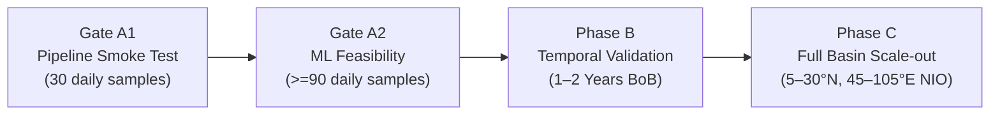

# OceanEmbed: Implementation Plan (SIH26066 Aligned)

## 1. Baseline System Assessment

The OceanEmbed framework is designed to infer 3D subsurface temperature profiles across 15 discrete vertical levels (0–1000m) from multi-sensor 2D surface fields over the North Indian Ocean under official Problem Statement **SIH26066**.

> [!NOTE]
> **Historical Supersession Notice:**
> - Earlier drafting referred to a 5-channel input and depth levels containing 400 m and 750 m over a 5°–25°N, 80°–100°E region.
> - **These are superseded:** Canonical input is strictly **7 channels** `[B, 7, H, W]`; output depths are the official **15 levels** `[0, 5, 10, 20, 30, 50, 75, 100, 125, 150, 200, 300, 500, 700, 1000]` m (with 125 m and 700 m replacing the former 400 m and 750 m); the official domain is **5°–30°N, 45°–105°E**; and the Bay of Bengal subset is designated strictly as an **MVP / pilot subset**.

### Official PS Specifications vs. MVP Pilot Scope:
- **Official Problem Statement Domain:** $5^\circ\text{N} - 30^\circ\text{N}, 45^\circ\text{E} - 105^\circ\text{E}$ (Full North Indian Ocean: Arabian Sea + Bay of Bengal).
- **MVP / Pilot Subset:** $12^\circ - 18^\circ\text{N}, 85^\circ - 93^\circ\text{E}$ (Phase-A focused box, selected to minimize expected coastal/land-mask contamination) or regional $5^\circ - 25^\circ\text{N}, 80^\circ - 100^\circ\text{E}$.
- **7 Canonical Input Channels:**
  1. `sst`: Sea Surface Temperature ($^\circ\text{C}$ / $\text{K}$)
  2. `sss`: Sea Surface Salinity ($\text{PSU}$)
  3. `ssh` / `sla`: Sea Surface Height / Sea Level Anomaly ($\text{m}$)
  4. `u_current`: Surface Current Zonal Velocity ($\text{m/s}$)
  5. `v_current`: Surface Current Meridional Velocity ($\text{m/s}$)
  6. `u_wind`: 10m Surface Wind Zonal Velocity ($\text{m/s}$)
  7. `v_wind`: 10m Surface Wind Meridional Velocity ($\text{m/s}$)
- **15 Canonical Output Depths:** `[0, 5, 10, 20, 30, 50, 75, 100, 125, 150, 200, 300, 500, 700, 1000]` m.
  - Target depth = 0m mapped to nearest surface GLORYS level (~0.494m). Blind extrapolation is forbidden.
  - Target depths > 0m vertically interpolated from native GLORYS thetao levels.
- **Supervision & Validation Terminology:**
  - Copernicus GLORYS12V1 is the **"reanalysis-derived training target"** / **"training supervision"**.
  - In-situ ARGO float profiles and RAMA buoys constitute the independent **"observational validation pathway"** / **"observational benchmark"**.

### Output Modes:
- **Profile Regression Mode (`[B, 7, H, W] -> [B, 15]`):** Maintained for the Gate A1 feasibility pilot.
- **Dense 3D Field Mode (`[B, 7, H, W] -> [B, 15, H, W]`):** Required for full spatial oceanographic reconstruction in subsequent phases.

### Existing State:
- **Codebase:** Fully functional PyTorch pipeline operating on synthetic generated data (`src/data.py`, `src/model.py`, `src/train.py`, `src/evaluate.py`, `src/visualize.py`, `src/inference.py`), aligned to 7 channels, 15 depths, and chronological temporal splitting.
- **Real Data Integration:** `GLORYSDataset` in `src/data.py` is a stub awaiting real NetCDF ingestion.
- **Environment:** Python 3.12.7, PyTorch 2.11.0 with CUDA 12.8 acceleration on NVIDIA GeForce RTX 4050 (6 GB VRAM).
- **Data on disk:** 0 real dataset bytes in `data/`. No large downloads initiated.

---

## 2. Phased Roadmap

### Gate A1: Real-Data Pipeline Smoke Test (30 Daily Samples)
- **Goal:** Prove end-to-end real-data mechanics, coordinate regridding, 7-channel stacking, and 15-depth loss convergence without large data overhead.
- **Data Source Mode:** Declared as `REANALYSIS_FALLBACK` in experiment metadata.
- **Explicit Declaration:** GLORYS-derived surface variables are NOT equivalent to the final satellite-observation input configuration.
- **Scope:** 30 daily time steps over a focused Bay of Bengal pilot box ($12^\circ - 18^\circ\text{N}, 85^\circ - 93^\circ\text{E}$), requiring only ~12–20 MB total download.
- **Milestones:**
  1. Implement `GLORYSDataset` with `xarray` for 7 surface input channels and 15 vertical target depths.
  2. Harmonize spatial coordinates to $0.25^\circ$ grid, calculate `ocean_coverage`, and apply channel-wise normalization.
  3. Verify all 14 Gate A1 automated acceptance tests in `tests/test_a1_acceptance.py`.
- **Scientific Caveat:** Gate A1 results are **not** presented as sufficient evidence of model generalization.

### Gate A2: Preliminary ML Feasibility Experiment (>=90 Daily Samples)
- **Goal:** Preliminary machine learning baseline comparison across a wider seasonal window (e.g. May–July 2020, capturing monsoon onset).
- **Milestones:**
  1. Benchmark `SatEmbedNet` against baseline predictors:
     - **Climatology Baseline:** Monthly mean vertical profile $T_{clim}(z)$.
     - **SST-only Linear Persistence:** $T(z) = a_z \cdot \text{SST} + b_z$.
     - **Multi-input Linear Regression:** $T(z) = \mathbf{W}_z \cdot \mathbf{x} + b_z$.
  2. Evaluate primary metrics (RMSE, Bias, Pearson Correlation) across full column and 50–200m thermocline (recording a 20% thermocline RMSE reduction as an optional stretch target only).

### Phase B: Larger Temporal Validation (Multi-Season / Multi-Year)
- **Goal:** Evaluate model generalization across seasonal regimes (Southwest Monsoon, Northeast Monsoon, pre-monsoon cyclone transitions).
- **Scope:** 1–2 contiguous years of daily records over the regional Bay of Bengal domain ($5^\circ - 25^\circ\text{N}, 80^\circ - 100^\circ\text{E}$).
- **Milestones:**
  1. Strict temporal split evaluation (train on earlier contiguous periods, test across later seasons to prevent autocorrelation leakage).
  2. Integration of seasonal day-of-year embeddings ($\sin / \cos$ calendar encodings) into the latent space.
  3. Independent observational validation against collocated in-situ ARGO float profiles.

### Phase C: Full North Indian Ocean Demonstration (Full PS Domain)
- **Goal:** Evaluate model generalization across the entire official problem statement domain.
- **Scope:** Full North Indian Ocean ($5^\circ - 30^\circ\text{N}, 45^\circ - 105^\circ\text{E}$), encompassing both the Arabian Sea and Bay of Bengal.
- **Milestones:**
  1. Cross-basin generalization: Test model trained on Bay of Bengal dynamics in Arabian Sea upwelling zones.
  2. Dense 3D spatial field inference (`[B, 15, H, W]`).
  3. Latent embedding export for downstream diagnostic tasks (upper-ocean heat content proxy analysis).

---

## 3. Risk & Mitigation Strategy

1. **Massive Data Download Risk:**
   - *Risk:* Unrestricted full-domain 10-year GLORYS + satellite records exceed several hundred gigabytes.
   - *Mitigation:* Strict phase progression. Gate A1 pilot is bounded strictly to ~12–20 MB. No large downloads until Gate A1 verification is reviewed and approved.
2. **Surface Current vs. Surface Wind Confusion:**
   - *Risk:* Merging surface currents with atmospheric winds into ambiguous "u/v" channels degrades physical interpretability.
   - *Mitigation:* Explicit 7-channel naming (`u_current`, `v_current` vs. `u_wind`, `v_wind`) and fixed channel indices [0..6] in configuration and data loaders.
3. **Reanalysis vs. Observational Validation Discrepancy:**
   - *Risk:* Treating GLORYS reanalysis as absolute truth masks model assimilation biases.
   - *Mitigation:* Designate GLORYS as reanalysis-derived training supervision; evaluate final generalization against independent in-situ ARGO CTD profiles.
4. **GPU Memory Constraints (RTX 4050 6 GB VRAM):**
   - *Risk:* 7 input channels + 15 vertical levels can cause OOM errors during spatial convolution.
   - *Mitigation:* Batch size $\le 16$, standard $0.25^\circ$ grid, mixed precision (`torch.amp.autocast`), and gradient accumulation if needed.
