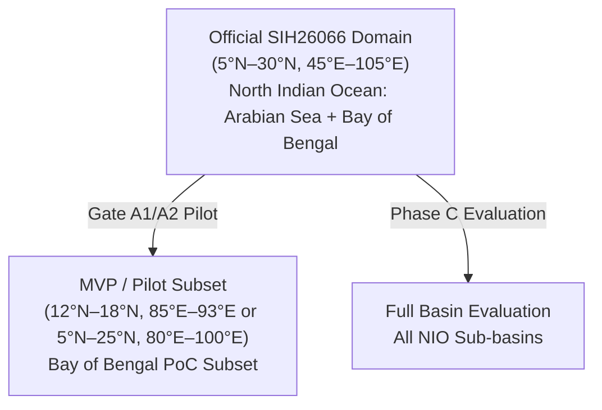
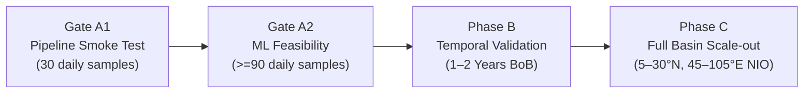

# OceanEmbed: SIH26066 Problem Statement Alignment & Specification

This document establishes the canonical specifications for the **OceanEmbed** project under official Problem Statement **SIH26066**: *"Estimation of 3D subsurface ocean temperature profiles from satellite-derived surface observations using deep representation learning"*.

All components across this repository (configuration files, data loaders, tensor dimensions, documentation, and evaluation scripts) strictly adhere to this specification.

---

## 1. Official Problem Statement Specifications

| Specification Item | Official SIH26066 Requirement | Repository Implementation Standard |
| :--- | :--- | :--- |
| **Geographic Domain** | **North Indian Ocean:** $5^\circ\text{N} - 30^\circ\text{N}$, $45^\circ\text{E} - 105^\circ\text{E}$ | `OFFICIAL_PS_DOMAIN` in `src/constants.py` |
| **Spatial Resolution** | $0.25^\circ \times 0.25^\circ$ spatial grid | Standardized grid resolution ($0.25^\circ$) |
| **Temporal Resolution** | Daily ($D$) time step | Daily time-series alignment |
| **Input Fields (Surface)**| **7 surface parameters** | **7 channels:** Tensor shape `[B, 7, H, W]` |
| **Output Depths** | **15 discrete vertical levels** ($0 - 1000\text{ m}$) | Depth levels `[0, 5, 10, 20, 30, 50, 75, 100, 125, 150, 200, 300, 500, 700, 1000]` m |
| **Training Supervision** | Ocean Reanalysis (`GLORYS12V1`) | **"Reanalysis-derived training target"** / **"Training supervision"** |
| **Observational Benchmark**| **INCOIS LAS — Gridded ARGO** (Indian Ocean) | **"Independent observational validation"** (point-to-grid comparison) |

---

## 2. Canonical Input Channels & Order

The model input tensor must strictly be **7 channels** with canonical shape `[B, 7, H, W]`. It must never be reduced or represented as a 5-channel problem.

A strict distinction is maintained between **surface currents ($U, V$)** and **surface winds ($U, V$)**:

| Channel Index | Channel Name | Variable Meaning | Official Primary Product (SIH26066) | Approved Fallback Option | Physical Units |
| :---: | :--- | :--- | :--- | :--- | :---: |
| **0** | `sst` | Sea Surface Temperature | **OSTIA** (0.05°, Daily) | NOAA OISST v2.1 / GLORYS `thetao` | $^\circ\text{C}$ or $\text{K}$ |
| **1** | `sss` | Sea Surface Salinity | **SMAP / SMOS** (0.125°, Daily) | CMEMS Multi-Year SSS L4 / GLORYS `so` | $\text{PSU}$ |
| **2** | `ssh` / `sla` | Sea Surface Height / Sea Level Anomaly | **DUACS** (0.25°, Daily) | GLORYS12V1 `zos` | $\text{m}$ |
| **3** | `u_current` | Surface Current Zonal Velocity | **OSCAR** (0.25°, Daily) | GLORYS12V1 `uo` ($z=0$) | $\text{m/s}$ |
| **4** | `v_current` | Surface Current Meridional Velocity | **OSCAR** (0.25°, Daily) | GLORYS12V1 `vo` ($z=0$) | $\text{m/s}$ |
| **5** | `u_wind` | 10m Surface Wind Zonal Velocity | **ASCAT-L2 Coastal / CCMP** (0.25°, Daily) | ECMWF ERA5 $10\text{m}$ Winds | $\text{m/s}$ |
| **6** | `v_wind` | 10m Surface Wind Meridional Velocity | **ASCAT-L2 Coastal / CCMP** (0.25°, Daily) | ECMWF ERA5 $10\text{m}$ Winds | $\text{m/s}$ |

---

## 3. Canonical Depth Levels & 0-Meter Target Transformation

The official SIH26066 vertical grid contains **exactly 15 depth levels** between 0 and 1000 meters:

$$\text{REQUIRED\_DEPTHS\_M} = [0, 5, 10, 20, 30, 50, 75, 100, 125, 150, 200, 300, 500, 700, 1000]\text{ meters}$$

> [!WARNING]
> **Depth Correction Notice:** Previous planning documents and configuration files referenced `400 m` and `750 m`. These values were **incorrect** and have been completely replaced by `125 m` and `700 m`. All depth definitions are centralized in `src/constants.py` as `REQUIRED_DEPTHS_M`.

### Explicit 0-Meter Target Handling:
GLORYS12V1's native uppermost model vertical level is approximately $0.494\text{ m}$. To prevent invalid mathematical artifacts:
- **For Target Depth $= 0\text{ m}$:** Map directly to the nearest valid surface GLORYS model level ($\approx 0.494\text{ m}$). Blind upward extrapolation to $0\text{ m}$ is strictly forbidden.
- **For Target Depths $> 0\text{ m}$:** Vertically interpolate from native GLORYS `thetao` geopotential levels without unconstrained extrapolation beyond deepest valid ocean levels.

---

## 4. Output Mode Distinction: Profile Regression vs. Dense 3D Field

- **Current Implementation (Profile Regression Mode):**
  - Shape: `[B, 7, H, W] -> CNN Encoder -> AdaptiveAvgPool -> [B, 15]`
  - Function: Regresses domain-average vertical profiles across the 15 standard depths for Gate A1 pipeline testing.
  - Scope Limit: Does **not** claim to be a dense 3D spatial field.
- **Future Problem Statement Target (Dense 3D Field Mode):**
  - Shape: `[B, 7, H, W] -> Spatial Encoder-Decoder (e.g. U-Net / FPN) -> [B, 15, H, W]`
  - Function: Yields full volumetric reconstructions where every horizontal pixel contains its own vertical profile $T(z, y, x)$.

---

## 5. Official Domain vs. MVP / Pilot Subset

To ensure clear communication and scientific rigor, the geographic boundaries are explicitly differentiated:

1. **Official PS Domain (`OFFICIAL_PS_DOMAIN`):**
   - Bounding Box: $5^\circ\text{N} - 30^\circ\text{N}$, $45^\circ\text{E} - 105^\circ\text{E}$
   - Scope: The entire North Indian Ocean, encompassing the Arabian Sea, Gulf of Oman, Persian Gulf, Bay of Bengal, and Andaman Sea.
2. **MVP / Pilot Subset (`MVP_PILOT_DOMAIN` / `GATE_A1_PILOT_BOX`):**
   - Bounding Box: $12^\circ - 18^\circ\text{N}, 85^\circ - 93^\circ\text{E}$ (Phase-A focused pilot box) or regional $5^\circ - 25^\circ\text{N}, 80^\circ - 100^\circ\text{E}$.
   - Selection Rationale: **Selected to minimize expected coastal/land-mask contamination.**
   - Empirical Metric: Actual ocean coverage (`ocean_coverage = valid_ocean_cells / total_grid_cells`) is calculated and reported upon file inspection.
   - **Critical Rule:** The Bay of Bengal pilot subset must *never* be described as the full PS domain.

---

## 6. Dataset Terminology & Observational Validation Distinction

To maintain strict oceanographic standard compliance:

- **Copernicus GLORYS12V1:**
  - Standard designation: **"Reanalysis-derived training target"** or **"Training supervision"**.
  - **Forbidden term:** *"Ground truth"* or *"GLORYS ground truth"*. GLORYS is a data-assimilating numerical model product ($\frac{1}{12}^\circ$ NEMO), not raw in-situ truth.
- **In-Situ Argo Floats & RAMA Mooring Array:**
  - Standard designation: **"Independent observational validation"** or **"Observational benchmark"**.
  - Avoid casually using "ARGO ground truth". Direct point-to-profile CTD physical sensor measurements provide genuine observational validation.

---

## 7. Data Source Modes

All experiments must explicitly declare one of three data source modes:

1. **`SATELLITE_OBSERVATION`**: Pure satellite observation inputs (e.g., NOAA OISST, SMAP SSS, DUACS Altimetry, OSCAR Currents, ERA5/CCMP Winds). This mode is required for the final Problem Statement demonstration.
2. **`REANALYSIS_FALLBACK`**: Surface layers extracted from reanalysis (e.g. GLORYS12V1 `tos`, `sos`, `zos`, `uo`, `vo`). Used strictly for initial engineering convenience and pipeline proof. **GLORYS-derived surface variables are NOT equivalent to the final satellite-observation input configuration.**
3. **`MIXED`**: Combination of satellite observations and reanalysis atmospheric forcing fields.

---

## 8. Phased Development Roadmap & Gating

| Phase / Gate | Designation | Temporal Scope | Spatial Scope | Purpose & Success Metric |
| :---: | :--- | :--- | :--- | :--- |
| **Gate A1** | **Real-Data Pipeline Smoke Test** | 30 daily samples (May 1–30, 2020) | Central Bay of Bengal Pilot Box ($12^\circ - 18^\circ\text{N}, 85^\circ - 93^\circ\text{E}$) | NetCDF ingestion, coordinate verification, regridding, masking, normalization, 7-channel tensor creation, 15-depth target creation, and GPU forward/backward pass. **NOT presented as evidence of model generalization.** |
| **Gate A2** | **Preliminary ML Feasibility Experiment** | $\ge 90$ daily samples (e.g. May–Jul 2020) | Central Bay of Bengal Pilot Box ($12^\circ - 18^\circ\text{N}, 85^\circ - 93^\circ\text{E}$) | Baseline comparison (Climatology, Linear Regression), temporal holdout split, and preliminary depth-wise RMSE/correlation/bias evaluation. A 20% thermocline RMSE reduction is classified as an optional stretch target only. |
| **Phase B** | **Larger Temporal Validation** | 1–2 years daily continuous | Bay of Bengal Basin ($5^\circ - 25^\circ\text{N}, 80^\circ - 100^\circ\text{E}$) | Evaluate seasonal cycle generalization (SW vs NE monsoons, cyclone transitions, seasonal stratification) and validate against collocated ARGO float profiles. |
| **Phase C** | **North Indian Ocean Basin Demonstration** | Multi-year | Full Official Domain ($5^\circ - 30^\circ\text{N}, 45^\circ - 105^\circ\text{E}$) | Demonstrate model applicability across both Arabian Sea (high salinity, upwelling) and Bay of Bengal (low salinity, freshwater capping) regimes. |

---

## 9. Gate A1 Automated Acceptance Criteria

Before any model training or evaluation, the ingested pipeline must satisfy all 14 automated acceptance tests defined in `tests/test_a1_acceptance.py`:

- [X] **exactly 7 input channels**
- [X] **exact channel ordering** (`sst`, `sss`, `ssh`, `u_current`, `v_current`, `u_wind`, `v_wind`)
- [X] **exact 15 target depths** (`REQUIRED_DEPTHS_M`)
- [X] **target depth 0 uses nearest surface level** (~0.494 m, no blind extrapolation)
- [X] **target depth interpolation produces no unintended extrapolation**
- [X] **daily timestamps**
- [X] **latitude ascending**
- [X] **longitude ascending**
- [X] **expected 0.25-degree output grid**
- [X] **units verified**
- [X] **missing-value policy verified**
- [X] **land/ocean coverage measured**
- [X] **tensor shape `[B, 7, H, W]`**
- [X] **target shape `[B, 15]`**

---

## 10. Requirement Classification Taxonomy

### A. Mandatory Requirements (Official SIH26066)
- Ingesting all 7 surface parameters (SST, SSS, SLA/SSH, Current U, Current V, Wind U, Wind V).
- Predicting subsurface temperature at the exact 15 standard depths ($0, 5, 10, 20, 30, 50, 75, 100, 125, 150, 200, 300, 500, 700, 1000\text{ m}$).
- Regridding to standard $0.25^\circ$ grid over daily intervals.
- Target coverage encompassing the North Indian Ocean ($5^\circ - 30^\circ\text{N}, 45^\circ - 105^\circ\text{E}$).
- Observational validation against independent in-situ ARGO profiles.

### B. Optional & Implementation Specifics
- Spatial sub-boxing for rapid development and testing (Gate A1/A2 pilot).
- Backbone architecture selection (CNN `SatEmbedNet` vs. ConvNeXt vs. Vision Transformer).
- Use of mixed precision (`torch.amp.autocast`) for memory optimization on consumer GPUs (e.g., RTX 4050 6 GB).
- Choice between direct OPeNDAP subset streaming and staged NetCDF caching.

### C. Proposed Innovations (Under Scientific Investigation)
- **Learned Satellite Embedding (`SatEmbedNet`):** Designed to learn a compact latent vector ($128\text{-d}$) from the multi-sensor surface state, evaluated against linear and empirical baselines.
- **Downstream Utility of Latent Embeddings:** Latent embedding hypothesized to provide useful representation features for ocean heat content (OHC) estimation, mixed-layer depth (MLD) diagnostic tracking, and data assimilation priors.
- **Physics-Informed Loss Constraints:** Vertical temperature monotonicity loss is classified strictly as an **optional experimental component** (not a required Phase-A component), as natural thermal inversions and barrier layers frequently occur in the Bay of Bengal.
- **Multi-Basin Transferability Analysis:** Investigating model adaptability between Arabian Sea and Bay of Bengal sub-regimes.
